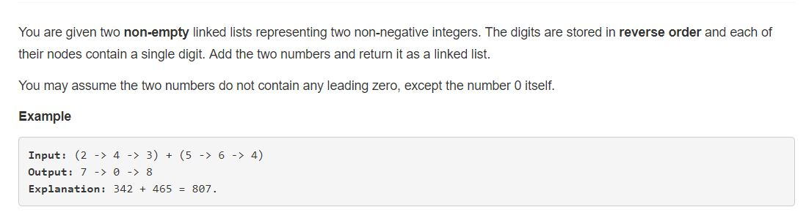

Problem Description:

class Solution:
    def addTwoNumbers(self, l1, l2):
        if(l1 == None or l2 == None):
            return
        size_l1 = 0
        size_l2 = 0
        ptr = l1
        while(ptr != None):
            size_l1 += 1
            ptr = ptr.next
        ptr = l2
        while(ptr != None):
            size_l2 += 1
            ptr = ptr.next
        carry = 0
        ptr1 = l1
        ptr2 = l2
        if(size_l1 >= size_l2):
            for i in range(0, size_l1):
                if(ptr2 != None):
                    ptr1.val += ptr2.val + carry
                    ptr2 = ptr2.next
                else:
                    ptr1.val += carry
                if(ptr1.val > 9):
                    ptr1.val -= 10
                    carry = 1
                else:
                    carry = 0
                prev = ptr1
                ptr1 = ptr1.next
            if(carry == 1):
                prev.next = ListNode(1)
            return l1
        else:
            for i in range(0, size_l2):
                if(ptr1 != None):
                    ptr2.val += ptr1.val + carry
                    ptr1 = ptr1.next
                else:
                    ptr2.val += carry
                if(ptr2.val > 9):
                    ptr2.val -= 10
                    carry = 1
                else:
                    carry = 0
                prev = ptr2
                ptr2 = ptr2.next
            if(carry == 1):
                prev.next = ListNode(1)
            return l2
